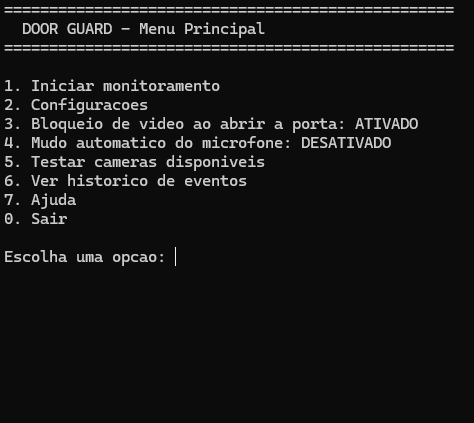
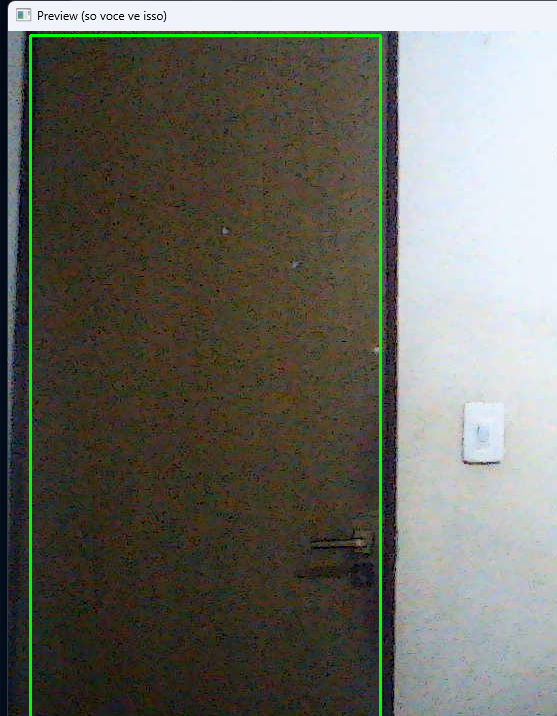

# Door Guard

Automação que corta a câmera e/ou muta o microfone automaticamente quando a porta do quarto abre durante uma chamada (Discord, Google Meet, Zoom, etc).

## Motivação

Minha câmera fica sempre apontada pro quarto, incluindo a porta. Como sempre tem gente abrindo e fechando ela durante chamadas, eu precisava desligar manualmente câmera e microfone toda vez. Esse projeto automatiza isso: o app detecta a porta abrindo e corta o sinal sozinho, sem eu precisar fazer nada.

## Como funciona

1. Uma região da imagem (a porta) é comparada continuamente com uma referência de "porta fechada".
2. Quando a diferença ultrapassa um limite e persiste por um tempo mínimo (pra ignorar gente só passando na frente), o app considera a porta aberta.
3. Nesse momento, o vídeo enviado pra câmera virtual vira "sem sinal" e/ou o microfone é mutado (cada um configurável e opcional).
4. Quando a porta fecha e a imagem estabiliza de novo, tudo volta ao normal.

## Imagens

**Menu inicial do terminal**

**Webcam com a porta sendo monitorada**

## Tecnologias

- **Python 3**
- **OpenCV** — captura de vídeo e detecção de mudança na região da porta
- **NumPy** — processamento de imagem
- **pyvirtualcam** + **OBS Virtual Camera** — envia o vídeo processado como uma webcam virtual, reconhecida pelo Discord/Meet/Zoom
- **pycaw** + **comtypes** — controle do microfone padrão do Windows

## Instalação

### 1. Instalar o Python
Baixe em [python.org/downloads](https://www.python.org/downloads/) e instale marcando a opção **"Add python.exe to PATH"**.

### 2. Instalar o OBS Studio
Baixe em [obsproject.com](https://obsproject.com/download) e instale. Abra o OBS uma vez, clique em **"Iniciar Câmera Virtual"**, depois pare e feche. Isso registra o driver "OBS Virtual Camera" no Windows (o OBS não precisa mais ficar aberto depois disso).

### 3. Baixar os arquivos do projeto
Coloque estes arquivos na mesma pasta:
- `door_guard.py`
- `requirements.txt`
- `iniciar_door_guard.bat`

## Uso

1. Dê duplo clique em `iniciar_door_guard.bat`. Na primeira vez ele cria um ambiente isolado e instala as dependências (mais lento); nas próximas abre direto.
2. No menu, escolha **"1. Iniciar monitoramento"**.
3. Desenhe um retângulo em volta da porta na janela de preview e confirme com ENTER/ESPAÇO.
4. Fique parado com a porta fechada por alguns segundos (calibração).
5. No Discord/Meet/Zoom, selecione **"OBS Virtual Camera"** como câmera.

## Configurações

Pelo menu **"2. Configurações"** dá pra ajustar sensibilidade de detecção, tempos de confirmação (abrir/fechar), FPS e índice da câmera — cada opção vem com explicação na hora de alterar.

- **"3. Bloqueio de vídeo"**: liga/desliga o corte de vídeo ao abrir a porta.
- **"4. Mudo automático do microfone"**: liga/desliga o mudo automático (opcional, independente do vídeo).
- **"6. Ver histórico"**: mostra o log de eventos (`historico.txt`) — cada abertura/fechamento de porta, mudo de mic, erros, com data e hora.

## Estrutura de arquivos gerados

- `config.json` — configurações salvas (criado automaticamente)
- `historico.txt` — log de eventos (criado automaticamente)

## Créditos

Desenvolvido por **[Miguel Lopes](https://www.linkedin.com/in/miguel-lopes-analyst/)**